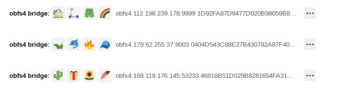

# Curso Hacking Básico

## General Resources:

* [Pentest-standard](http://www.pentest-standard.org/index.php/Main\_Page)
* [Foro The Hacking Way](https://thehackerway.com/)
* [StartPage browser](https://www.startpage.com/)
* [KrakenRDI](https://github.com/Adastra-thw/KrakenRdi)
* [https://idoc.pub/documents/hacking-con-python-6nq8p3576pnw](https://idoc.pub/documents/hacking-con-python-6nq8p3576pnw)
* [0XWORD PYTHON PARA PENTESTERS.PDF](file:///C:/Users/ALUMNO\_17/Downloads/0XWORD%20PYTHON%20PARA%20PENTESTERS.PDF)
* [Torsocks](https://github.com/dgoulet/torsocks): To use a tor connection&#x20;
* [Pentest academy](https://www.pentesteracademy.com/pricing)
* [Privilege escalation](https://delinea.com/blog/windows-privilege-escalation) own search

Investigate tor browser bridges (puentes en la pestaña de conexión). Is very usefull to avoid firewalls.

```
apt install torsocks

```

* [Dradis](https://dradisframework.com/): to document and integrate all info obtained in a vulnerability scan

### Firefox plugins:

* Foxyproxy: we can use it with a tor proxy
* Https everywhere: to force all trafic throught https
* DNSlytics: To obtain details abbout the conexion
* Wappalyzer: To discover service versions
* Hacktools: to obtain a lot of information (including payloads)

## Creación de diccionarios

[Pydictor:](https://thehackerway.com/2021/01/20/generacion-de-diccionarios-para-fuerza-bruta-con-pydictor/)&#x20;

## OSINT

* [Osintframework](https://osintframework.com/)
* [Scansless](https://github.com/vesche/scanless): To Realize scans without using our infrastructure

To execute scanless:

Is very interesting to collect initial data and been able to specify our ports in nmap later.

```
sudo pip install scanless
scanless -t scanme.nmap.org -r
```

* [Spiderfoot](https://www.spiderfoot.net/)

```
spiderfoot -l 0.0.0.0:5000
# Now we go to that port: localhost:5000
```

* [Social Engineer Framework](https://www.social-engineer.org/)

## Vuln Scan

### Nmap

We need to take into account the importance of the Nmap scripts

```markup
ls /usr/share/nmap/scripts
nmap -sscript filename|catefory|directory/expression[,...]
nmap -sV --script smb-* -p 139 192.168.80.184 

```

If we obtain the open|filtered after a particular scan, we can use the ACK scan `-sA` and obain the response unfiltered.

#### ufw firewall

To practice with nmap. we enable the ufw in the vulnerable machine. `sudo ufw enable`&#x20;

We are gonna practice with port 21 TCP.

```
sudo ufw enable 
sudo ufw allow 21/tcp
sudo ufw deny 88/tcp
```

## Metasploit

To configure the db `sudo msfdb init`&#x20;

Now we open msf and create a workspace `workspace -a MSF2`

```python
search mysql type:auxiliary  #To search specific modules
```


## Docker

To install it on kali `sudo apt install docker.io`&#x20;

Different commands to test the installation:

```
sudo systemctl status docker
sudo systemctl stop docker
sudo systemctl restart docker
ps -fea | grep "docker"

```

Different commands:

```python
sudo docker run hello-world #If we don't have it internally, it will try to downloadit 
sudo docker run -it hello-wold #-it to be interactive from terminal
sudo docker ps #To see the installed containers (if something does not appear is because their objetive has finished and are closed)
sudo docker ps -a # To see ALL containers
sudo docker run --name ubuntu -it ubuntu #All together. We run a docker with the name of "ubuntu"
sudo docker container prune #To delete all containers
exit #inside the container
sudo docker run -d --name ubuntu -it ubuntu #With -d we open it and after exiting it wont close
sudo docker exec dockername ps #To execute commands in a particual docker container
sudo docker image -help #To see the options using image
 sudo docker image rm #Remove images using name or id
sudo docker container stop conainername #To stop a container
sudo docker container start containername #To start a container
sudo docker run -d --name ubuntu --rm -it ubuntu #--it to delete it just after exiting
sudo docker exec -it hello3 bash #To connect to a docker container
sudo docker run -d --name hello4 --rm -it -p 3003:80 -v /tmp:/monataje nginx #To add persisency in a particular folder. The first folder is in our kali machine and the second folder in the docker container


```

All docker images have a Dockerfile file. Inside we have all the important information about the needed libraries and more.

After deleting a docker, all the info and log are deleted also.

### Port forwarding&#x20;

```python
sudo docker run -d --name hello2 --rm -it -p 3000:80 nginx #Open a nginx server
#The traffic from the 3000 in the kali machine will go to the port 80.
```

### Virtual networks inside docker

Docker can resolve the DNS by docker name

```python
sudo docker network create net1 #We create a net interface that we can test using ip a
sudo docker network connect net1 hello2 #We connect hello2 to net1
sudo docker network connect net1 hello3 #We connect hello3 to net1
apt update && apt install iputils-ping #Install ping to test the connection


```

### Docker info

we can find all the docker information in the `/var/lib/docker` in the host machine.

```python
sudo docker inspect hello2 #Also, we can inspect all docker container's information using this command
sudo docker volume ls #To analyze docker volumes

```

### Other commands

```python
sudo docker run -d -it --name priv1 --net=host ubuntu #With --net=host stabish the same netork interface fo rthe host
sudo docker run -d -it --name priv3 -v /:/montaje ubuntu #We mount all directories
sudo docker run -d -it --name priv3 --pid=host ubuntu #With the same process as host
sudo docker run -d -it --name priv3 --net=host --pid=host -v /:/montaje ubuntu #All together
sudo docker logs hello3 #To see the logs
sudo docker stats #To see docker stats and consume
```

### Docker bench

[Docker bench security](https://github.com/docker/docker-bench-security): has a guide to follow all the aspect and execute the script in the kali machine to know if everything is well configured in the different containers.

```python
git clone https://github.com/docker/docker-bench-security.git
sudo ./docker-bench-security.sh
#And now, we need to check the info obtained
```

### Test with elasticsearch docker image

```python
sudo docker run -d --name elasticsearch -it -p 9000:9000 benhall/elasticsearch:1.4.2

```

### To analyze docker images:

We can use truve from "aqua security" [here](https://github.com/aquasecurity/trivy). It search vulnerabilities, passwords, missconfigurations, etc. To install it locally we need to download the 64bits.deb and install locally: `sudo apt install ./tryvy_035....deb.`

```
trivy image ubuntu:latest
```

## OpenVAS Docker

to install, we use this [link](https://github.com/mikesplain/openvas-docker)

```python
sudo docker run -d -p 443:443 --name openvas mikesplain/openvas:9
```

## Metasploitable3

To configure it we follow this [link](https://github.com/rapid7/metasploitable3) or use a ova.

We start using metasploit.

```python
msfconsole
sudo msfdb init #In other terminal
db_status #In metasploit
workspace -a MSF3
```

Tools used:

* hydra
* evil-winrm
* nbtscan
* crackmapexec
*

```python
msfvenom --info format #To see the formats
```

## AD With Vulnerabilities





## Payload in binary

With msfvenom or lordpe, we can create a legitimate executable with a payload.

Codecabin&#x20;

## Hacking WEB

### sqlmap

To work with sqlmap is always better to detect the vulnerable request and send it later to the sqlmap commnad line.

In order to be able to excute different applications using only the name without specifying the route we need to edit the PATH and the ENV.

```bash
sqlmap -r <FICHERO> --level=5 --risk=3 --current-user
sqlmap -r <FICHERO> --level=5 --risk=3 --current-db
sqlmap -r <FICHERO> --level=5 --risk=3 -D <nombre_db> --tables
sqlmap -r <FICHERO> --level=5 --risk=3 -D <nombre_db> -T <tabla> --dump
#The file is te copy to file option of burp request
```

### Tor Browser

To configure TorBrowser, we need to edit the `Configure Connection` settings after opening Tor Browser Setup.

<figure><figcaption></figcaption></figure>

It won't work by default due that the default nodes are known are normally blocked by ISP or firewalls. Thre are hidden nodes (bridges) to avoid and bypass the censorship.&#x20;

1. Request a Bridge
2.

    <figure><figcaption></figcaption></figure>

Now we will be able to bypass the Firewall block.

If you can't connect, use a `Select a Built-In Bridge`

``

